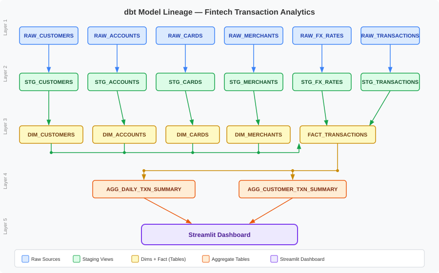

# Fintech Transaction Analytics | dbt + Snowflake Analytics Engineering Project

## Author

**Vu Duc Cong**

Fresh graduate from Singapore Management University (SMU)
Bachelor of Science in Information Systems, with a second major in Data Science & Analytics

I am a passionate data professional with strong interest in analytics engineering, business intelligence, and scalable data systems. This project was independently designed and built to demonstrate practical competence in:

* Git & GitHub version control workflow (branching, pull requests, production governance)
* dbt (data build tool) — modelling, testing, documentation, macros
* Snowflake cloud data warehousing
* SQL data transformation
* YAML schema documentation & data testing
* End-to-end analytics engineering architecture
* Streamlit BI dashboard development

This repository is both a technical project and a professional portfolio touchpoint for recruiters, hiring managers, and employers to understand how I approach real-world data problems through structured engineering, testing, and business-oriented design.

---

## Project Purpose

This project showcases how raw fintech operational data can be transformed into production-grade, analytics-ready datasets using modern ELT practices.

The objective was to simulate how enterprise data teams design scalable transformation pipelines that support:

* BI dashboards
* Product analytics
* Customer behaviour analysis
* Operational monitoring
* Financial reporting

---

## Technical Stack

### Core Technologies

| Layer | Technology |
|-------|-----------|
| Data Warehouse | Snowflake |
| Transformation | dbt Core v1.11+ |
| Dashboard | Streamlit (Snowflake Community Cloud) |
| Language | SQL, Python |
| Version Control | Git / GitHub |

### Data Modeling Framework

* Dimensional Modeling (Star Schema)
* RAW → STAGING → MARTS architecture
* Fact & Dimension table design
* Aggregate summary tables (`agg_` prefix)

---

## Pipeline Architecture



> **Naming convention:** `fct_` prefix is reserved for `FACT_TRANSACTIONS`, which holds one row per transaction event. Aggregate/summary tables use the `agg_` prefix to make the distinction explicit.

---

## Project Overview

### Raw Source Tables

| Table | Description |
|-------|-------------|
| `RAW_CUSTOMERS` | Customer profiles, KYC status, demographics |
| `RAW_ACCOUNTS` | Account types, balances, status |
| `RAW_CARDS` | Card details, network, limits |
| `RAW_MERCHANTS` | Merchant categories, onboarding, status |
| `RAW_FX_RATES` | Daily exchange rates for multi-currency conversion |
| `RAW_TRANSACTIONS` | Raw transaction events |

### Staging Layer (dbt Views)

One view per source — casts types, renames columns, applies null handling. No business logic.

### Marts Layer (dbt Tables)

#### Core Dimensions

| Model | Grain | Key Additions |
|-------|-------|---------------|
| `DIM_CUSTOMERS` | One row per customer | `age_band`, `account_tenure_days`, `is_recent_signup`, `kyc_tier` |
| `DIM_ACCOUNTS` | One row per account | Status flags, currency |
| `DIM_CARDS` | One row per card | Network, type, activity flags |
| `DIM_MERCHANTS` | One row per merchant | `merchant_tenure_days`, `is_established_merchant`, `merchant_tenure_band` |

#### Fact Table

| Model | Grain | Description |
|-------|-------|-------------|
| `FACT_TRANSACTIONS` | One row per transaction event | FX-converted amounts, status flags, signed cashflow, cross-border flag |

#### Aggregate Tables

| Model | Grain | Powers |
|-------|-------|--------|
| `AGG_DAILY_TRANSACTION_SUMMARY` | Date × Currency × Channel × Status | Executive Overview dashboard |
| `AGG_CUSTOMER_TRANSACTION_SUMMARY` | One row per customer | Customer Intelligence dashboard |

---

## Snowflake Schema Layout

```text
┌─────────────────────────────────────────────┐
│    Snowflake FINTECH_ANALYTICS Database      │
├─────────────────────────────────────────────┤
│                                             │
│  RAW Schema  (loaded externally)            │
│  ├── RAW_CUSTOMERS                          │
│  ├── RAW_ACCOUNTS                           │
│  ├── RAW_CARDS                              │
│  ├── RAW_MERCHANTS                          │
│  ├── RAW_FX_RATES                           │
│  └── RAW_TRANSACTIONS                       │
│                                             │
│  RAW_STAGING Schema  (dbt views)            │
│  ├── STG_CUSTOMERS                          │
│  ├── STG_ACCOUNTS                           │
│  ├── STG_CARDS                              │
│  ├── STG_MERCHANTS                          │
│  ├── STG_FX_RATES                           │
│  └── STG_TRANSACTIONS                       │
│                                             │
│  RAW_MARTS Schema  (dbt tables)             │
│  ├── DIM_CUSTOMERS                          │
│  ├── DIM_ACCOUNTS                           │
│  ├── DIM_CARDS                              │
│  ├── DIM_MERCHANTS                          │
│  ├── FACT_TRANSACTIONS                      │
│  ├── AGG_DAILY_TRANSACTION_SUMMARY          │
│  └── AGG_CUSTOMER_TRANSACTION_SUMMARY       │
│                                             │
└─────────────────────────────────────────────┘
```

---

## Key Business Logic

### 1. Multi-Currency FX Conversion

All transactions are normalised to SGD using daily FX rates, with a fallback to the most recent available rate when an exact daily rate is missing. The fallback uses a correlated subquery (`max rate_date <= transaction_date`), ensuring no transaction is left without a valid conversion rate.

### 2. Signed Cashflow Logic

| Transaction Type | Sign |
|-----------------|------|
| PURCHASE / WITHDRAWAL / TRANSFER | Negative (outflow) |
| DEPOSIT / REFUND | Positive (inflow) |

### 3. Customer Analytical Enrichment

`DIM_CUSTOMERS` is enriched with derived attributes requiring no extra joins:

* `age_band` — generational cohort (Gen Z, Millennial, Gen X, Boomer+)
* `account_tenure_days` — days since signup
* `is_recent_signup` — TRUE if signed up within the last 12 months
* `kyc_tier` — simplified KYC label (Fully Verified / Pending Review / Unverified)

### 4. Merchant Tenure Segmentation

`DIM_MERCHANTS` is enriched with:

* `merchant_tenure_days` — days since onboarding
* `is_established_merchant` — TRUE if onboarded > 365 days ago
* `merchant_tenure_band` — New / Growing / Established / Mature

### 5. `safe_divide` Macro

A reusable null-safe division macro in `macros/safe_divide.sql` wraps Snowflake's `IFF` to return `NULL` instead of raising a division-by-zero error when the denominator is `0` or `NULL`. Used across all rate/percentage calculations in aggregate models.

```sql
{{ safe_divide('count(case when is_successful then 1 end) * 100.0', 'count(*)') }}
```

### 6. Data Quality Governance

* **131 dbt tests** covering all models
* Primary key uniqueness
* Not-null constraints
* Accepted values validation
* Referential integrity (relationship tests across all FK joins)

---

## Key Achievements

* Built 13 dbt models end-to-end (6 staging, 5 core, 2 aggregate)
* **131/131 data quality tests passing**
* Implemented full Git feature branch → PR → main workflow
* Designed BI-ready dimensional star schema
* Built reusable `safe_divide` macro for null-safe division
* Enriched dim tables with analytical attributes (age band, tenure, KYC tier)
* Refactored Streamlit dashboard to use aggregate tables — no full fact table scans
* Production-style schema documentation with dbt docs

---

## Dashboards & Visualization

**Interactive Streamlit dashboards** powered by Snowflake data, built to translate analytics into actionable business insights.

**Dashboard URL: https://duccongvuanalytics.streamlit.app/**


### 1. Executive Overview
Real-time financial performance dashboard for leadership decision-making:
* **Key Metrics**: Total transactions, volume (SGD), fee revenue, success rate, failed count, cross-border transactions — displayed in two rows of three for full readability
* **Monthly Summary**: Period-over-period breakdown table
* **Trends**: Daily transaction volume area chart
* **Composition**: Status breakdown, channel breakdown, currency mix
* **Geography**: Cross-border vs domestic split
* **Filters**: Year, month, channel, currency

### 2. Customer Intelligence
Deep-dive customer behaviour and segmentation analytics:
* **Key Metrics**: Total customers, avg spend (SGD), avg transactions, KYC verified rate, avg active days
* **Segmentation**: Customer segment distribution, KYC status, age band distribution, preferred channel
* **Value Analysis**: Spend by segment, top 10 customers by spend
* **Cohorts**: Activity summary by segment, spend by country
* **Filters**: Customer segment, KYC status, country

### 3. Transaction Operations
Operational health & failure monitoring dashboard:
* **Key Metrics**: Success rate, failure rate, pending transactions, total failed
* **Monthly Ops Summary**: Success/failure rates by period
* **Failures Tab**: Failure reason breakdown (targeted 200-row query — no full table scan)
* **Detail Tab**: Failed transaction drill-down with cross-border count
* **Filters**: Year, month, channel, transaction status

### Technical Implementation
* **Data Source**: Snowflake aggregate tables from dbt marts — no raw fact table loaded into memory
* **Performance**: `@st.cache_data(ttl=600)` caching; failed transaction drill-down uses targeted `LIMIT 200` SQL query
* **Resilience**: Null-safe metric formatting; filter-aware KPI recomputation from aggregates

---

## Example Business Questions Supported

### Customer Analytics
* Who are the highest-value customers by lifetime spend?
* Which customer segments have the highest KYC verification rate?
* How does spend differ across age bands and geographies?

### Transaction Monitoring
* What are the daily and monthly transaction volume trends?
* Which channels have the highest failure rates?
* What are the most common failure reasons?
* How much cross-border volume is being processed?

### Merchant Insights
* Which merchant categories drive the most transaction volume?
* How does merchant tenure correlate with transaction activity?

---

## Repository Structure

```text
fintech-transaction-analytics-dbt/
│
├── models/
│   ├── staging/
│   │   └── fintech_raw/          # STG_ views (one per raw source)
│   └── marts/
│       ├── core/                 # DIM_ + FACT_ tables
│       ├── aggregates/           # AGG_ summary tables
│       └── schema.yml            # Tests & documentation
│
├── macros/
│   ├── safe_divide.sql           # Null-safe division macro
│   └── generate_schema_name.sql  # Custom schema routing
│
├── streamlit/
│   └── streamlit_app.py          # Streamlit dashboard (3 pages)
│
├── docs/
│   └── dag_lineage.svg           # Model lineage diagram
│
├── tests/                        # Custom singular tests
├── seeds/                        # Static reference data
├── dbt_project.yml
└── README.md
```

---

## Running the Project

```bash
# Verify connection
dbt debug

# Run all models + tests
dbt build

# Run a specific layer
dbt build --select staging
dbt build --select marts

# Run only changed models
dbt build --select state:modified+

# Generate & serve docs
dbt docs generate
dbt docs serve
```

---

## Professional Intent

As a fresh graduate entering the data industry, I built this project not simply to practice tools, but to demonstrate readiness for modern data roles through:

* **Technical execution** — end-to-end pipeline from raw data to BI dashboard
* **Business logic translation** — FX conversion, cashflow signing, KYC tiering
* **Production discipline** — 131 passing tests, PR-based workflow, documented macros
* **Performance awareness** — aggregate-first dashboard design, targeted queries

I believe strong data work is not only about writing SQL, but about designing systems that are scalable, testable, and useful for business decision-making.

---

## About Me

I am actively pursuing opportunities across:

* Data Analytics
* Analytics Engineering
* Business Intelligence
* Data Strategy

With internship experience across startup, hypergrowth, and enterprise environments, this project represents my effort to further strengthen warehouse architecture and transformation engineering capability.

---

## Contact

**Vu Duc Cong**
Singapore Management University
Bachelor of Science (Information Systems + Data Science & Analytics)

GitHub profile and project repository serve as demonstrations of my technical and analytical capability.

---

## Final Note

This project was built to reflect not just technical competency, but professional intent: the ability to design trustworthy data systems that transform raw information into strategic business value.
